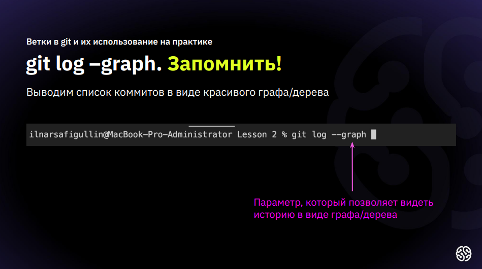
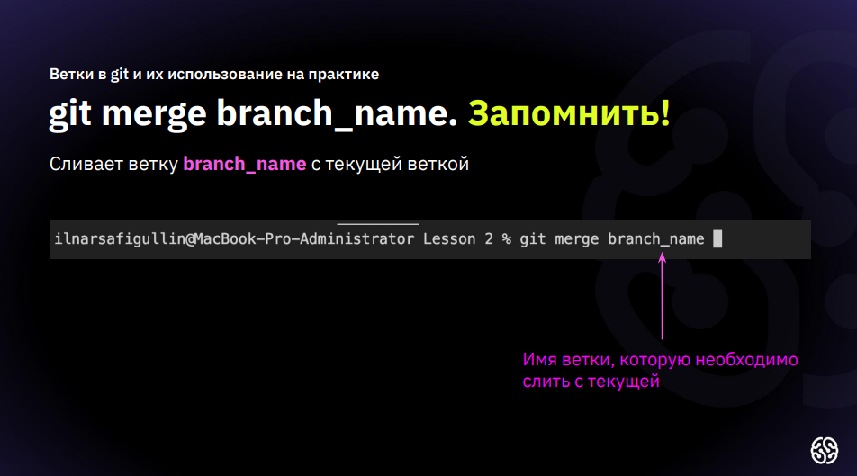

● Жирный текст — **
-

● Курсивный текст — *
-

● Зачеркнутый текст — ~
-

● Выделяют заголовки —

# в начале строки

-

● Показать уровень заголовка —
подчеркивание знаками = или -
-

● Нумерованные Списки —
обозначаются обычными
цифрами 1, 2, 3
-

● Ненумерованные Списки —
обозначаются знаками *
-

в начале строки
● Вложенные Списки —
выполняем отступы

# Инструкция по гит &#8220;&#8221; &#8217; &#8216;

[!NOTE]
1 *git init* - **команда инициализации репозитория локально**
-

[!TIP]
2 *git add* - **команда для добавления изменений или файла в отслеживание репозитория локально**
-

[!IMPORTANT]
3 *git commit -m "some message"* - **команда для закриплений изменений в репозиторий**
-

[!CAUTION]
4 *git log* - **команда для вывода журнала изменений**
-

[!WARNING]
5 *git status* - **команда для просмотра локальных изменений**
-

6 *git diff* - **команда для просмотра различий между изменениями**
-

7 *git checkout (master)* - **команда для перемещения между коммитами**
-

<https://yandex.ru/images/search?from=tabbar&source-serpid=ZG4zjH8w9Pae96pdP58GSQ&text=%D0%92%D0%BE%D0%B4%D0%BE%D0%BF%D0%B0%D0%B4&nl=1&source=morda&pos=2&rpt=simage&img_url=https%3A%2F%2Fcs.pikabu.ru%2Fpost_img%2Fbig%2F2013%2F11%2F29%2F7%2F1385720670_1067174999.jpg>

строчка спецыальноо для добавления коммита

*git branch* - **команда для вывода списка веток**

*git branch branch_name* - **команда для создания новой ветки**

*git checkout branch_name* - **команда для перехода на другую ветку**

